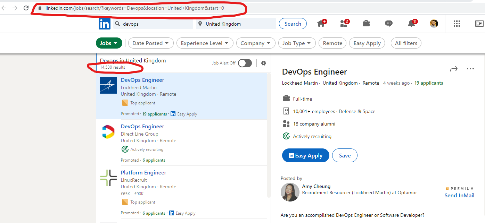

# linkein-job-scraper
this project is intial work on building python script function helps Niya LTD to build in-house soloution for analying the market, define the right learning pathway for its new joiner 


 ## lib to install
 Scrape public available jobs on Linkedin using headless browser. For each job, the following fields are extracted:
 job_id, link, apply_link, title, company, place, description, description_html, date, seniority_level, job_function, employment_type, industries.

## linkedin-job-scraper
pip install linkedin-jobs-scraper

 ## see this link for indepth library check 
https://pypi.org/project/linkedin-jobs-scraper/

  ## Requiment
 - Chrome
 - ChromDriver   https://chromedriver.chromium.org/
 - Python >= 3.6S

  ## to install node_modules, go to the respective direcoty of your project and run
 npm i 

 ## USEFUL html SELECTOR
number of job result  ```<small aria-live="polite" class="display-flex t-12 t-black--light t-normal">``` <br>
 ul for the skills ```<ul class="jobs-premium-applicant-insights__list pt2 ph0 pb0 display-flex flex-wrap">```<br>
 when the scipt run for the fist time its request the following URL 'https://www.linkedin.com/jobs/search/?keywords=Devops&location=United+Kingdom&start=0'  then number of job result appear

 

